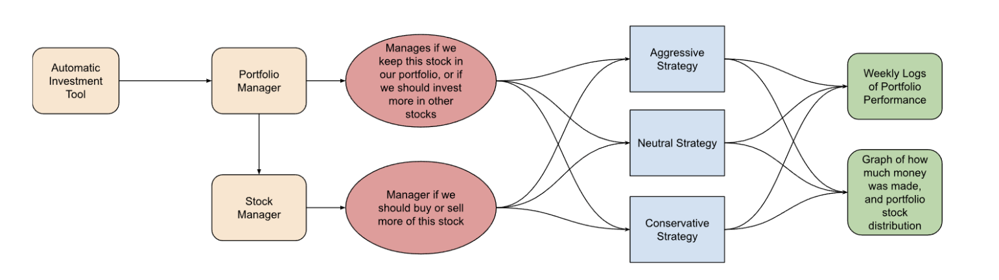

# Computer Programming Group Project: Stock Market Investment Manager


## Usage


### Activate the Conda Environment

```
conda activate stocks
```

### Build the Project

- Make sure to run the following on the root directory

```
mkdir build
cd ./build
cmake ..
make
```

### To Run
```
cd ./bin
./main
```

# Project Info

## Concept Diagram



# Steps

1. Intro
    1. User is asked about how much money he wants to invest into the selection of stocks
    2. User is asked which strategy he wants to follow:
        - Aggressive
        - Neutral
        - Conservative
2. Volatility Calculation 
    1. Volatility is calculated from the price data for each respective ticker (see below for formula interpretation)
3. Stock Manager + Portfolio Manager
    1. Based on the chosen strategy the stock manager will choose the follwing:
        - If, and how much of the current position in the stock will be sold.
        - If, and how much of the current position in the stock will be added onto the portfolio.
    2. Based on the decision of the stock manager, the portfolio manager will then do the following:
        - Decide how and where to allocate the current available funds to other available stocks within the portfolio.
4. Visualization
    1. Output a log of the weekly portfolio performance with each of the trades/allocations done by the managers.
    2. Show a visualization of the portfolio's value over the time period the user has requested, alongside each individual stock performance.


# Function Documentation

## `calculate_percentage_changes`
This function calculates the percentage price changes for a set of stocks over time.

**Parameters**
- `ticker_to_prices`: A map where the key is a stock ticker (`std::string`) and the value is a vector of historical prices (`std::vector<double>`).

**Returns**
- A map where each key corresponds to a stock ticker and each value is a vector of percentage changes between consecutive price points.

**Design Choices**
- **Avoid Division by Zero**: Ensures no division by zero occurs by checking if the previous price is non-zero.
- **Zero Change for Invalid Cases**: In cases where the previous price is zero, the change is recorded as 0.0 for clarity and consistency.
- **Iterative Calculation**: Uses a loop for precise control over logic and computational efficiency.

---

## `stockManager`
This function evaluates which stocks to buy or sell and calculates reallocated funds based on a given strategy.

**Parameters**
- `stocks`: A map of stock tickers and their volatility vectors (`std::vector<double>`).
- `my_portfolio`: A map representing the user's current stock holdings and their monetary value (`std::map<std::string, double>`).
- `strategy`: A user-defined strategy (`optimistic`, `neutral`, or `conservative`) to guide trading decisions.

**Returns**
- A `StockManagerResult` struct containing:
  - `buying_stocks`: Stocks to buy at each hour.
  - `selling_stocks`: Stocks to sell at each hour.
  - `reallocation_funds`: Funds freed up through selling at each hour.

**Design Choices**
- **Strategy-Based Logic**: Implements differentiated behavior (`optimistic`, `neutral`, `conservative`) to adapt to varying user preferences.
- **Volatility Analysis**: Incorporates stock volatility to refine buy/sell decisions, using thresholds to determine aggressiveness.
- **Dynamic Portfolio Updates**: Updates portfolio values directly during decision-making to ensure consistency.

---

## `portfolio_manager`
This function manages fund allocations across stocks for each hour and tracks portfolio value changes due to market fluctuations.

**Parameters**
- `buying_stocks`: A list of stocks to purchase at each hour (`std::vector<std::vector<std::string>>`).
- `reallocation_funds`: Available funds for reallocation after selling stocks (`std::vector<double>`).
- `my_portfolio`: User's current portfolio with stock values (`std::map<std::string, double>`).
- `strategy`: Trading strategy to guide allocation decisions (`std::string`).
- `stocks`: Map of stocks and their volatility vectors (`std::map<std::string, std::vector<double>>`).
- `ticker_to_percentage_changes`: Map of stock tickers and their percentage price changes (`std::map<std::string, std::vector<double>>`).

**Returns**
- A `PortfolioManagerResult` struct containing:
  - `allocations`: The amount allocated to each stock at each hour.
  - `portfolio_values`: The total value of the portfolio at each hour.

**Design Choices**
- **Dynamic Allocation Weights**: Adjusts weights based on the chosen strategy and average volatility to align with risk tolerance.
- **Hour-by-Hour Adjustments**: Reflects real-time portfolio changes and maintains temporal granularity.
- **Market Fluctuation Tracking**: Applies percentage changes to portfolio values dynamically to simulate real market behavior.

---

## `main`
This function simulates the stock trading program with predefined inputs, including stock data, user strategy, and initial portfolio.

**Parameters**
- None (all inputs are hardcoded for the simulation).

**Returns**
- None (outputs results to the console).

**Design Choices**
- **Data Encapsulation**: Uses structs for managing complex output data (e.g., `StockManagerResult` and `PortfolioManagerResult`).
- **Stepwise Processing**: Separates key stages (percentage calculation, stock management, portfolio updates) to ensure modularity.
- **Comprehensive Output**: Provides detailed logging of decisions and results for transparency.


## Strategies
There will be three main strategies:

- Conservative: Approach that sells more often when the volatility is higher
- Neutral: Approach sells and buys an equal amount given a normal range of volatility
- Optimistic: Approach sells less often when the volatility is higher

---

# Mathematical Formulas + Examples


### $\text{Volatility}$ = $\sigma$ = $\sqrt{\frac{\sum_{i=1}^N (r_i - \bar{r})^2}{N-1}}$

Where:
- $\sigma$: Volatility (standard deviation of returns)
- $r_i$: Return of the stock in the \(i\)-th period
- $\bar{r}$: Average return over the period
- $N$: Number of periods

## Updating Volatility: Exponentially Weighted Moving Average (EWMA) 

### $\text{Updated Volatility}$ = $\sigma^2_t = (1 - \lambda) r^2_t + \lambda\sigma^2_{t-1}$

Where: 
- $\sigma^2_t$ : Updated Volatility
- $\sigma^2_{t-1}$ : Previous Variance
- $r^t = ln(\frac{P_{new}}{P_{old}})$ : is the log return
- $\lambda$ : is the Decay Factor (Determines how much weight is given to recent returns versus historical volatility.)
